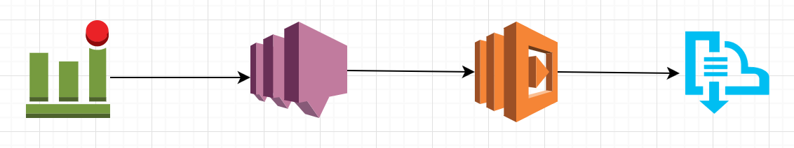

## Synopsis

This repo will create deployable lambda function to send cloudwatch alarms to EMF.

## Motivation

This project provide working code sample to send cloudwatch alarms to Event Management Framework. After deploying this package you will be able to send cloudwatch alarms to EMF via SNS and Lambda

## Installation

After cloning this repository, you can check emf_cloudwatch.py file. You can run following command and it will create emf_cloudwatch.zip package for you depending on environment you are deploying.

`./create_package.sh [prod/dev]`

Once this package is ready you can run AWS CLI command to upload this package and create lambda function from it.
Make sure you have already created lambda_basic_execution role, also attach "AmazonEC2ReadOnlyAccess" to the policy.

For EC2
`aws lambda create-function --function-name  emf_cloudwatch_ec2 --runtime "python2.7" --role <lambda_basic_execution ARN> --description "Create EMF Lambda function" --handler "emf_cloudwatch_ec2.lambda_handler" --publish  --zip-file fileb:///<path/to/emf_cloudwatch_ec2.zip>`

To update already existed lambda function run following command
`aws lambda update-function-code --function-name emf_cloudwatch_ec2 --zip-file fileb:///<path/to/emf_cloudwatch_ec2.zip>`

For RDS
`aws lambda create-function --function-name  emf_cloudwatch_rds --runtime "python2.7" --role <lambda_basic_execution ARN> --description "Create EMF Lambda function" --handler "emf_cloudwatch_rds.lambda_handler" --publish  --zip-file fileb:///<path/to/emf_cloudwatch_rds.zip>`

To update already existed lambda function run following command
`aws lambda update-function-code --function-name emf_cloudwatch_rds --zip-file fileb:///<path/to/emf_cloudwatch_rds.zip>` 

Note the ARN of the above lambda function

You can create SNS topic with following command
`aws sns create-topic --name emf_cloudwatch`

Note the ARN of the above SNS topic

You can make lambda function subscribe to this SNS topic by using following command
`aws sns subscribe --topic-arn <ARN of emf_cloudwatch> --protocol lambda --notification-endpoint <ARN of lambda function>`

That's it! Now you can easily send Alarm to SNS topic and that will propogate to EMF when cloudwatch creates alarm.

## Contributors

sbodas@expedia.com
wwilkins@expedia_group.com

## License

A short snippet describing the license (MIT, Apache, etc.)
